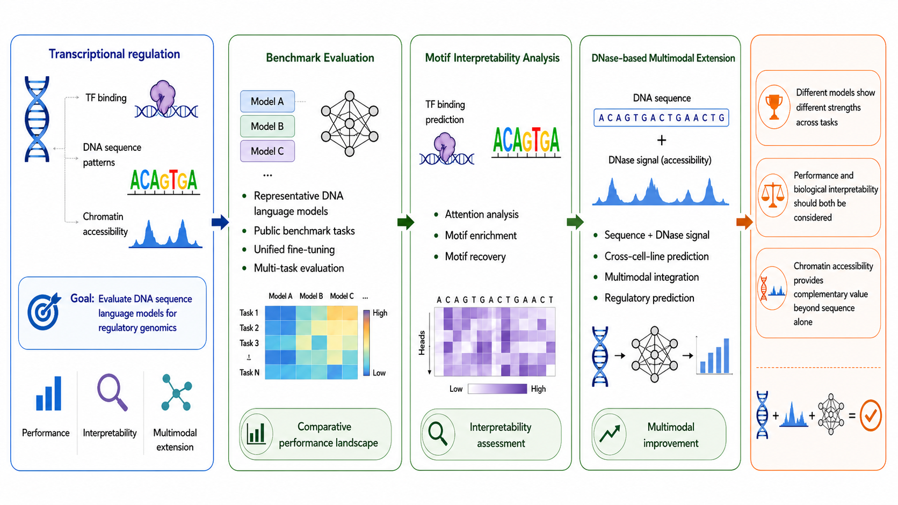

# GLM Benchmark

**Genomic Language Model Benchmark and Multimodal Extension**

A reproducible benchmark suite accompanying the thesis *"Genomic Foundation Model Benchmark and Multi-modal Extension Study"* (Zhang Jiajing, 2025). The repository covers three self-contained experiments that evaluate DNA language models on public classification benchmarks, dissect their internal attention with motif interpretability tools, and extend them with DNase-seq chromatin accessibility signals for cross-cell-type TF binding prediction.

---

## Overview



| Experiment | Topic | Models |
|---|---|---|
| [Exp1 — Public Benchmark](Exp1_Public-dataset-bench/) | Fine-tune five DNA LMs on 40 NT + GUE tasks; compare MCC across models and tasks | DNABERT-2, NT-v2-500M, GENA-LM, HyenaDNA, GROVER |
| [Exp2 — Motif Interpretability](Exp2_Motif-Interpretability-Analysis/) | TFBS fine-tuning → attention enrichment on known FIMO motifs → attention-guided TF-MoDISco motif discovery | DNABERT-2, GENA-LM, GROVER, NT-v2-500M |
| [Exp3 — DNase Multimodal](Exp3_%20DNase-based-Multimodal-Extension/) | Cross-cell-type TF binding prediction with sequence-only vs. sequence + DNase signal; evaluate AUPRC on held-out GM12878 | Basic CNN-LSTM, DNABERT-2, GROVER, GENA-LM, NT-v2-500M, HyenaDNA |

---

## Installation

All three experiments share a single conda environment. Create it from the top-level `environment.yml`:

```bash
mamba env create -f environment.yml
conda activate glm_benchmark
```

Then install each experiment's Python package in editable mode:

```bash
pip install -e Exp1_Public-dataset-bench/finetune
pip install -e Exp2_Motif-Interpretability-Analysis
pip install -e "Exp3_ DNase-based-Multimodal-Extension"
```

> **CUDA note**: The environment file targets CUDA 12.1 PyTorch. On a CPU-only machine, remove `pytorch-cuda=12.1` and the `nvidia` channel before creating the environment.

> **Cluster modules**: If your cluster provides `bedtools`, `samtools`, or MEME Suite as modules, load those modules before running the corresponding scripts; the conda packages for those tools can be omitted.

---

## Model Weights

Download pretrained model checkpoints with `huggingface-cli download`. The table below lists all models used across the three experiments.

| Alias | Model | HuggingFace repo | Notes |
|---|---|---|---|
| `dnabert2_117m` | DNABERT-2 117M | `zhihan1996/DNABERT-2-117M` | Requires `trust_remote_code=True` |
| `ntv2_500m_multi` | Nucleotide Transformer v2 500M | `InstaDeepAI/nucleotide-transformer-v2-500m-multi-species` | Requires `trust_remote_code=True` |
| `gena_bigbird_t2t` | GENA-LM BigBird Base T2T | `AIRI-Institute/gena-lm-bigbird-base-t2t` | Standard HF snapshot |
| `hyenadna_large_1m` | HyenaDNA Large 1M | `LongSafari/hyenadna-large-1m-seqlen-hf` | Requires `trust_remote_code=True` |
| `grover` | GROVER | `PoetschLab/GROVER` | Standard HF snapshot |

```bash
huggingface-cli download PoetschLab/GROVER --local-dir /path/to/model_files/GROVER
```

---

## Experiment 1 — Public Benchmark Fine-tuning

### Datasets

- **Nucleotide Transformer (NT) revised tasks**: 18 tasks (promoter, enhancer, splice sites, histone modifications) — available on [HuggingFace](https://huggingface.co/datasets/InstaDeepAI/nucleotide_transformer_downstream_tasks)
- **GUE**: 22 human single-sequence tasks (EMP histone, promoter, splice/reconstructed, TF binding) — available on [Google Drive](https://drive.google.com/file/d/1uOrwlf07qGQuruXqGXWMpPn8avBoW7T-/view)

### Quick Start

```bash
# Full matrix on one GPU (all models × all tasks)
bash Exp1_Public-dataset-bench/finetune/scripts/run_matrix.sh --bf16

# Single model/task
bash Exp1_Public-dataset-bench/finetune/scripts/run_matrix.sh \
  --dataset NT --model grover --task enhancers --bf16

# Smoke test (no real training)
bash Exp1_Public-dataset-bench/finetune/scripts/run_matrix.sh \
  --dataset NT --model grover --task enhancers --smoke-test \
  --data-root /path/to/data --model-root /path/to/model_files
```

See [Exp1_Public-dataset-bench/finetune/](Exp1_Public-dataset-bench/finetune/) for notebooks and detailed documentation.

---

## Experiment 2 — Motif Interpretability Analysis

### Data Sources

ChIP-seq peak files and reference genome data used in Exp2 are documented in [Exp2_Motif-Interpretability-Analysis/data_sources.md](Exp2_Motif-Interpretability-Analysis/data_sources.md).

Required reference files:

```
Data/
  reference/hg38.fa
  reference/hg38.chrom.sizes
  reference/hg38-blacklist.v2.bed
  original_peaks/<TF>_peaks.bed
  meme/<TF>*.meme
  meme/JASPAR2024_CORE_non-redundant_pfms_meme.txt
```

### Workflow

```bash
# 1. Build TFBS datasets (positive from ChIP-seq peaks, GC-matched negatives)
bash Exp2_Motif-Interpretability-Analysis/scripts/00_run_preprocess.sh

# 2. Fine-tune TF-specific classifiers
TF_NAME=CTCF MODEL_TYPE=dnabert2 bash Exp2_Motif-Interpretability-Analysis/scripts/01_run_finetune_bpe.sh --bf16 True
TF_NAME=CTCF bash Exp2_Motif-Interpretability-Analysis/scripts/02_run_finetune_nt.sh --bf16 True

# 3. Run FIMO and map motif coordinates to model tokens
bash Exp2_Motif-Interpretability-Analysis/scripts/03_run_fimo.sh
bash Exp2_Motif-Interpretability-Analysis/scripts/04_run_motif_mapping.sh

# 4. Extract CLS attention and compute motif-vs-background enrichment
MODEL_TYPE=DNABERT-2 OUTPUT_MODEL_NAME=DNABERT2_5.6 \
  bash Exp2_Motif-Interpretability-Analysis/scripts/05_run_attention_stats.sh

# 5. Attention-guided motif discovery (TF-MoDISco)
MODEL_TYPE=DNABERT-2 OUTPUT_MODEL_NAME=DNABERT2_5.6 \
  bash Exp2_Motif-Interpretability-Analysis/scripts/06_run_discovery.sh

# 6. Visualize discovered-vs-JASPAR similarity heatmaps
MODEL_TYPE=DNABERT2_5.6 bash Exp2_Motif-Interpretability-Analysis/scripts/07_run_visualization.sh
```

> **Note**: LDB1 has no known JASPAR motif, so FIMO-dependent steps are skipped for this TF.

See [Exp2_Motif-Interpretability-Analysis/](Exp2_Motif-Interpretability-Analysis/) for notebooks demonstrating the full pipeline with CTCF + NT as an example.

---

## Experiment 3 — DNase Multimodal Extension

### Data Sources

DNase-seq and ChIP-seq data used in Exp3 are documented in [Exp3_ DNase-based-Multimodal-Extension/data_sources.md](<Exp3_ DNase-based-Multimodal-Extension/data_sources.md>).

- **Training cell lines**: K562, HepG2, Lung
- **Test cell line**: GM12878 (cross-cell-type generalization)
- **TFs**: BRD4, CTCF, EZH2, GABPA, POLR2A, USF2

### Workflow

```bash
# 1. Extract DNase-centered 1000 bp windows from all cell lines
bash "Exp3_ DNase-based-Multimodal-Extension/scripts/00_prepare_dnase_bins.sh"

# 2. Build per-cell-line HDF5 datasets (sequence + DNase signal + labels)
bash "Exp3_ DNase-based-Multimodal-Extension/scripts/01_create_datasets.sh"

# 3. Merge training cell lines; copy GM12878 as held-out test
bash "Exp3_ DNase-based-Multimodal-Extension/scripts/02_merge_datasets.sh"

# 4. Fine-tune models (sequence-only and sequence+DNase modes)
bash "Exp3_ DNase-based-Multimodal-Extension/scripts/04_finetune_BPE.sh" CTCF --model_name GROVER

# 5. Extract AUPRC results and plot
bash "Exp3_ DNase-based-Multimodal-Extension/scripts/07_extract_auprc.sh"
bash "Exp3_ DNase-based-Multimodal-Extension/scripts/08_plot_auprc.sh"
```

See [Exp3_ DNase-based-Multimodal-Extension/](<Exp3_ DNase-based-Multimodal-Extension/>) for notebooks demonstrating data preparation and fine-tuning with CTCF + GROVER.

---

## Citation

If you use this code or data, please cite the associated thesis:

```
Zhang Jiajing. Genomic Foundation Model Benchmark and Multi-modal Extension Study. 2025.
```
